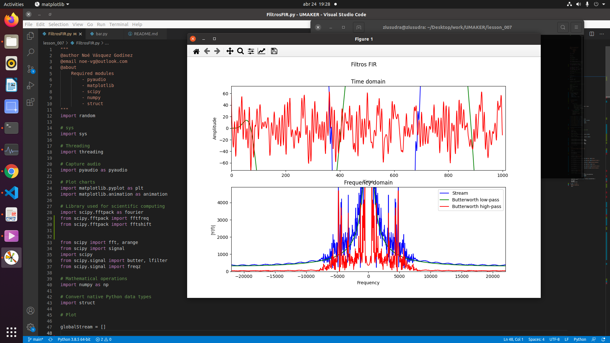

# About
Source codes for Raspberry pi course lessons: applications python processing
digital signals, images and AI.

# Requeriments

In the system GNU/Linux need install


## Recording Audio with PyAudio

``` 
sudo apt-get install libasound-dev

sudo apt-get install libasound-dev portaudio19-dev libportaudio2 libportaudiocpp0

sudo apt-get install ffmpeg libav-tools

``` 

## Scientific Python Distributions

```
pip install scipy

``` 
# Examples:
- **Butterworth low-pass**
- **Butterworth high-pass**

<center>

</center>

## Run with:

```
python3 FiltrosFIR.py

``` 
### Note

play the **canario-sonido.mp3**


# Actions to be taken

Pendiente sacar el filtro de butherword a la señal (probar crear el filtro a 900Hz)
