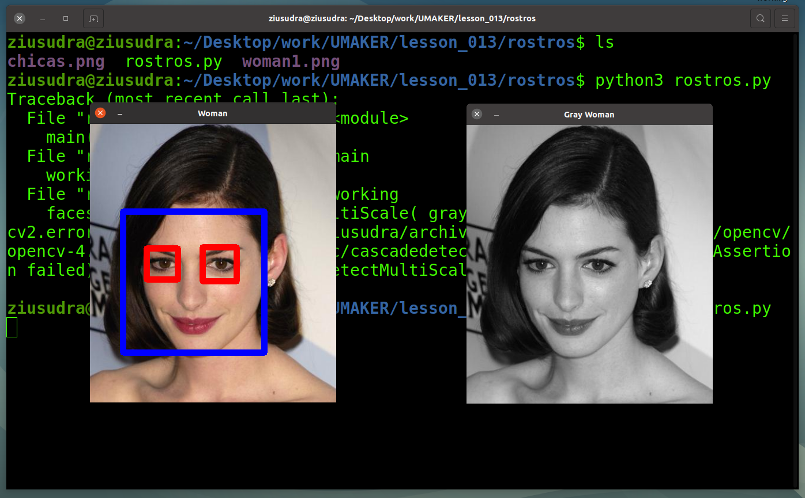

# About
Source codes for Raspberry pi course lessons: applications python processing
digital signals, images and AI.

# Requeriments

In the system GNU/Linux need install

## Install OpenCV
``` 
pip install opencv-python
                ó
python3 -m pip install opencv-python
``` 
## Recording Audio with PyAudio

``` 
sudo apt-get install libasound-dev

sudo apt-get install libasound-dev portaudio19-dev libportaudio2 libportaudiocpp0

sudo apt-get install ffmpeg libav-tools

``` 

## Scientific Python Distributions

```
pip install scipy

``` 
# Examples:
- **CascadeClassifier with OpenCV**

<center>

</center>

## Run with:

```
python3 lesson_013/rostros/rostros.py

``` 
